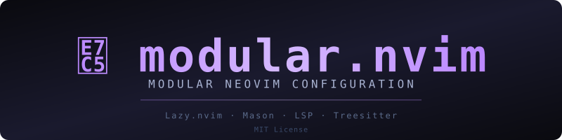

<div align="center">



#  modular.nvim

**Modular Neovim configuration for daily development**

[](https://neovim.io/)
[](https://github.com/folke/lazy.nvim)
[](https://www.linux.org/)
[](https://www.apple.com/macos/)
[](https://learn.microsoft.com/en-us/windows/wsl/)
[](LICENSE.md)

[](https://github.com/masaji-ef/modular.nvim/stargazers)
[](https://github.com/masaji-ef/modular.nvim/network/members)
[](https://github.com/masaji-ef/modular.nvim/watchers)
[](https://github.com/masaji-ef/modular.nvim/commits)

[Features](#-features) •
[Installation](#-installation) •
[Forking](#-forking--updates) •
[Plugins](#-plugins) •
[Keymaps](#-keymaps) •
[License](#-license)

</div>

---

## 📖 Description

A modular Neovim configuration powered by [💤 lazy.nvim](https://github.com/folke/lazy.nvim). Everything is organized into logical categories (`cmp`, `format`, `lint`, `lsp`, `syntax`, `ui`, `util`), making it easy to customize and extend.

---

## ✨ Features

- **Modular structure** — plugins organized by category
- **Lazy loading** — fast startup with `lazy.nvim`
- **Mason integration** — automatic LSP/formatting tool installation
- **LSP support** — Lua, Python, Bash, C/C++ and more
- **Auto-completion** — nvim-cmp with snippets
- **Formatting** — conform.nvim with prettierd, ruff, stylua, shfmt, clang-format
- **Linting** — nvim-lint with luacheck, shellcheck
- **File explorer** — neo-tree with Git status
- **Fuzzy finder** — telescope.nvim with fzf
- **Modern UI** — tokyonight theme, lualine, which-key
- **Auto-save** — automatic file saving
- **Harpoon** — quick file navigation
- **Trouble** — diagnostics in a beautiful list
- **Flash** — lightning fast navigation
- **Mini suite** — icons, move, comment, indentscope, surround, trailspace, cursorword, hipatterns
- **Gitsigns** — git decorations in sign column

---

## 🛠️ Installation

### Requirements

- Neovim >= **0.11.0** (required for latest nvim-treesitter)
- Git >= **2.19.0**
- [Nerd Font](https://www.nerdfonts.com/) (optional, for icons)
- C compiler (gcc, make, unzip)
- [ripgrep](https://github.com/BurntSushi/ripgrep)
- [fd-find](https://github.com/sharkdp/fd) (optional)

### Quick start

```bash
git clone https://github.com/masaji-ef/modular.nvim.git ~/.config/nvim
nvim
```

Lazy will automatically install all plugins. Wait for installation to complete.

tree-sitter CLI will be auto-installed on first run.

### Installing LSP/Formatting Tools

```bash
:Mason
```

Or manually (Fedora):

```bash
sudo dnf install lua-language-server clangd ruff bash-language-server
npm install -g prettierd
```

---

## 🔀 Forking & Updates

### Option 1: Use as-is (get updates)

```bash
git clone https://github.com/masaji-ef/modular.nvim.git ~/.config/nvim
cd ~/.config/nvim && git pull
```

### Option 2: Fork and customize (recommended)

1. **Fork** the repository on GitHub
2. **Clone your fork**:

```bash
git clone https://github.com/YOUR_USERNAME/modular.nvim.git ~/.config/nvim
```

3. **Make changes** — edit files in `lua/modular/plugins/`
4. **Commit and push**:

```bash
git add .
git commit -m "my custom changes"
git push
```

### Keep your fork in sync

```bash
cd ~/.config/nvim
git remote add upstream https://github.com/masaji-ef/modular.nvim.git
git fetch upstream
git merge upstream/main
```

---

## 📦 Plugins

### Core

| Plugin                                                                                    | Description        |
| ----------------------------------------------------------------------------------------- | ------------------ |
| [lazy.nvim](https://github.com/folke/lazy.nvim)                                           | Plugin manager     |
| [mason.nvim](https://github.com/williamboman/mason.nvim)                                  | Tool installer     |
| [mason-lspconfig.nvim](https://github.com/williamboman/mason-lspconfig.nvim)              | LSP bridge         |
| [mason-tool-installer.nvim](https://github.com/WhoIsSethDaniel/mason-tool-installer.nvim) | Auto-install tools |

### Editing

| Plugin                                                                | Description      |
| --------------------------------------------------------------------- | ---------------- |
| [nvim-cmp](https://github.com/hrsh7th/nvim-cmp)                       | Auto-completion  |
| [nvim-snippy](https://github.com/dcampos/nvim-snippy)                 | Snippets         |
| [nvim-autopairs](https://github.com/windwp/nvim-autopairs)            | Auto-close pairs |
| [better-escape.nvim](https://github.com/max397574/better-escape.nvim) | Better escape    |
| [auto-save.nvim](https://github.com/pocco81/auto-save.nvim)           | Auto-save        |

### LSP & Tools

| Plugin                                                     | Description       |
| ---------------------------------------------------------- | ----------------- |
| [nvim-lspconfig](https://github.com/neovim/nvim-lspconfig) | LSP configuration |
| [conform.nvim](https://github.com/stevearc/conform.nvim)   | Formatting        |
| [nvim-lint](https://github.com/mfussenegger/nvim-lint)     | Linting           |

### UI

| Plugin                                                       | Description     |
| ------------------------------------------------------------ | --------------- |
| [tokyonight.nvim](https://github.com/folke/tokyonight.nvim)  | Theme           |
| [lualine.nvim](https://github.com/nvim-lualine/lualine.nvim) | Statusline      |
| [which-key.nvim](https://github.com/folke/which-key.nvim)    | Keymap helper   |
| [gitsigns.nvim](https://github.com/lewis6991/gitsigns.nvim)  | Git decorations |

### Navigation

| Plugin                                                             | Description          |
| ------------------------------------------------------------------ | -------------------- |
| [telescope.nvim](https://github.com/nvim-telescope/telescope.nvim) | Fuzzy finder         |
| [neo-tree.nvim](https://github.com/nvim-neo-tree/neo-tree.nvim)    | File explorer        |
| [harpoon](https://github.com/ThePrimeagen/harpoon)                 | Quick navigation     |
| [trouble.nvim](https://github.com/folke/trouble.nvim)              | Diagnostics          |
| [flash.nvim](https://github.com/folke/flash.nvim)                  | Lightning navigation |

### Syntax

| Plugin                                                                | Description         |
| --------------------------------------------------------------------- | ------------------- |
| [nvim-treesitter](https://github.com/nvim-treesitter/nvim-treesitter) | Syntax highlighting |
| [todo-comments.nvim](https://github.com/folke/todo-comments.nvim)     | TODO comments       |

### Utilities (mini.nvim)

| Plugin                                                              | Description          |
| ------------------------------------------------------------------- | -------------------- |
| [mini.icons](https://github.com/echasnovski/mini.icons)             | Icons everywhere     |
| [mini.move](https://github.com/echasnovski/mini.move)               | Move selections      |
| [mini.comment](https://github.com/echasnovski/mini.comment)         | Commenting           |
| [mini.indentscope](https://github.com/echasnovski/mini.indentscope) | Indent guides        |
| [mini.surround](https://github.com/echasnovski/mini.surround)       | Surround handling    |
| [mini.trailspace](https://github.com/echasnovski/mini.trailspace)   | Trailing whitespace  |
| [mini.cursorword](https://github.com/echasnovski/mini.cursorword)   | Word under cursor    |
| [mini.hipatterns](https://github.com/echasnovski/mini.hipatterns)   | Pattern highlighting |

---

## ⌨️ Keymaps

### General

| Key             | Action               |
| --------------- | -------------------- |
| `<leader>e`     | Toggle file explorer |
| `<leader>o`     | Focus file explorer  |
| `<leader>f`     | Format buffer        |
| `<leader>q`     | Close buffer         |
| `<C-d>`/`<C-u>` | Scroll and center    |
| `n`/`N`         | Search and center    |

### Flash (navigation)

| Key     | Action                |
| ------- | --------------------- |
| `s`     | Jump to any position  |
| `S`     | Treesitter navigation |
| `r`     | Remote operation      |
| `R`     | Treesitter search     |
| `<C-s>` | Toggle flash search   |

### Telescope

| Key          | Action         |
| ------------ | -------------- |
| `<leader>sf` | Find files     |
| `<leader>sg` | Live grep      |
| `<leader>sw` | Grep word      |
| `<leader>sd` | Diagnostics    |
| `<leader>sb` | Current buffer |
| `<leader>su` | Undo tree      |
| `<leader>sn` | Neovim files   |

### LSP

| Key          | Action            |
| ------------ | ----------------- |
| `gd`         | Go to definition  |
| `gr`         | Find references   |
| `K`          | Hover             |
| `<leader>la` | Code actions      |
| `<leader>lr` | Rename            |
| `<leader>ld` | Diagnostics float |

### Harpoon

| Key           | Action              |
| ------------- | ------------------- |
| `<leader>ha`  | Add file            |
| `<leader>j`   | List files          |
| `<leader>hc`  | Clear list          |
| `<leader>1-4` | Open file by number |

### Trouble

| Key          | Action             |
| ------------ | ------------------ |
| `<leader>td` | Toggle diagnostics |
| `<leader>ts` | Toggle symbols     |
| `<leader>tl` | LSP references     |
| `<leader>tL` | Location list      |
| `<leader>tQ` | Quickfix list      |

---

## 🎨 Supported Languages

| Language          | LSP    | Formatter    | Linter     |
| ----------------- | ------ | ------------ | ---------- |
| **Lua**           | lua_ls | stylua       | luacheck   |
| **Python**        | ruff   | ruff         | ruff       |
| **Bash/Zsh**      | bashls | shfmt        | shellcheck |
| **C/C++**         | clangd | clang-format | -          |
| **JavaScript/TS** | -      | prettierd    | -          |
| **JSON/HTML/CSS** | -      | prettierd    | -          |
| **Markdown**      | -      | prettierd    | -          |

---

## 🖥️ Supported Platforms

| OS                                | Status          |
| --------------------------------- | --------------- |
| 🐧 **Linux (Fedora/Debian/Arch)** | ✅ Full support |
| 🍎 **macOS**                      | ✅ Full support |
| 🪟 **Windows (WSL2)**             | ✅ Full support |

---

## 📄 License

MIT License. Based on [Kickstart.nvim](https://github.com/nvim-lua/kickstart.nvim).

<div align="center">

### ⭐ Star this repo if you find it useful!

[](https://github.com/masaji-ef/modular.nvim/stargazers)
[](https://github.com/masaji-ef/modular.nvim/network/members)

</div>
